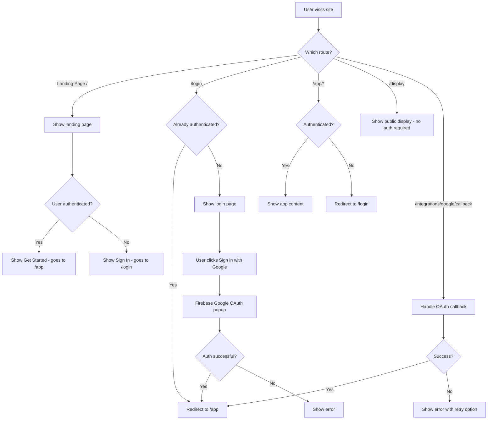

# Implementation Plan: Landing Page, Route Restructure & Auth Enhancement

## Current State Analysis

### Existing Routing Structure
| Route | File | Purpose | Auth Required |
|-------|------|---------|---------------|
| `/` | `src/app/page.tsx` | Main dashboard (currently) | Yes (redirect to /login) |
| `/login` | `src/app/login/page.tsx` | Login with Google | No |
| `/console` | `src/app/console/page.tsx` | Manage displays & subscription | Yes |
| `/display` | `src/app/display/page.tsx` | Read-only display view | No (public, uses query param) |
| `/integrations/google/callback` | `src/app/integrations/google/callback/page.tsx` | OAuth callback | No |

### Current Authentication Implementation
- **Location:** [`AuthContext.tsx`](src/contexts/AuthContext.tsx)
- **Provider:** Firebase Auth with Google Sign-in via `signInWithPopup`
- **Exposed API:** `user`, `loading`, `signInWithGoogle`, `logout`
- **Protection Method:** Per-page `useEffect` hooks that redirect to `/login` if not authenticated
- **No centralized middleware** for route protection

### Current Components Structure
- **Dashboard:** `src/components/dashboard/` - Contains grid, settings, frames, carousel components
- **Calendar:** `src/components/calendar/` - Full page calendar, views, event handling
- **No dedicated navigation component** - Navigation is embedded in page headers

---

## Proposed File Structure Changes

### New Route Architecture
```
src/app/
├── page.tsx                    # NEW: Landing page (public)
├── layout.tsx                  # Root layout (unchanged)
├── globals.css                 # Global styles (unchanged)
├── login/
│   └── page.tsx               # Login page (update redirect to /app)
├── app/                        # NEW: Protected app group
│   ├── layout.tsx             # NEW: App layout with auth guard & navigation
│   ├── page.tsx               # MOVED from root: Dashboard
│   └── console/
│       └── page.tsx           # MOVED: Console page
├── display/
│   └── page.tsx               # UNCHANGED: Public display view
└── integrations/
    └── google/
        └── callback/
            └── page.tsx       # UPDATE: Redirect to /app on success
```

### New Components Structure
```
src/components/
├── landing/                    # NEW: Landing page components
│   ├── Hero.tsx               # Hero section with CTA
│   ├── Features.tsx           # Features showcase
│   ├── HowItWorks.tsx         # How it works section
│   ├── Testimonials.tsx       # Social proof (optional)
│   └── Footer.tsx             # Landing page footer
├── navigation/                 # NEW: Navigation components
│   ├── AppNavigation.tsx      # Main app navigation with console links
│   ├── UserMenu.tsx           # User profile dropdown (extracted)
│   └── NavLinks.tsx           # Navigation links component
└── auth/                       # NEW: Auth-related components
    └── ProtectedRoute.tsx     # Route protection wrapper (optional)
```

---

## Implementation Steps

### Phase 1: Create Landing Page

#### Step 1.1: Create Landing Page Components
Create new components in `src/components/landing/`:

**Hero.tsx Structure:**
- Headline describing the product
- Subheadline with value proposition
- CTA button linking to `/login` or `/app`
- Optional hero image/illustration

**Features.tsx Structure:**
- Grid of feature cards showcasing:
  - Calendar integration (Google Calendar)
  - Multiple display support
  - Customizable widgets
  - Real-time sync
  - Family/household sharing

**HowItWorks.tsx Structure:**
- Step-by-step visual guide:
  1. Sign in with Google
  2. Connect your calendars
  3. Create display configurations
  4. View on any screen

**Footer.tsx Structure:**
- Links section (Privacy, Terms, etc.)
- Copyright notice

#### Step 1.2: Create Landing Page Route
Replace `src/app/page.tsx` with a new landing page that:
- Is accessible without authentication
- Shows Hero, Features, HowItWorks, Footer sections
- Includes prominent Sign In / Get Started buttons
- Redirects authenticated users to `/app`

---

### Phase 2: Restructure App Routes

#### Step 2.1: Create App Route Group
Create `src/app/app/` directory structure:
- `src/app/app/layout.tsx` - Layout with navigation and auth protection
- `src/app/app/page.tsx` - Move current dashboard code here

#### Step 2.2: Move Console Page
- Move `src/app/console/page.tsx` to `src/app/app/console/page.tsx`
- Update any internal links

#### Step 2.3: Update Login Redirect
Modify `src/app/login/page.tsx`:
- Change success redirect from `/` to `/app`

#### Step 2.4: Update OAuth Callback
Modify `src/app/integrations/google/callback/page.tsx`:
- Change success redirect from `/` to `/app`

---

### Phase 3: Implement Route Protection

#### Step 3.1: Create Protected App Layout
Create `src/app/app/layout.tsx`:
```tsx
// Pseudo-structure
- Check authentication state
- Show loading state while checking
- Redirect to /login if not authenticated
- Render children with navigation wrapper if authenticated
```

#### Step 3.2: Remove Per-Page Auth Checks
After implementing layout-level protection:
- Remove redundant `useEffect` auth checks from:
  - `src/app/app/page.tsx` (dashboard)
  - `src/app/app/console/page.tsx`

---

### Phase 4: Create App Navigation

#### Step 4.1: Extract User Menu Component
Create `src/components/navigation/UserMenu.tsx`:
- Extract the user profile dropdown from current dashboard
- Include sign out functionality

#### Step 4.2: Create App Navigation Component
Create `src/components/navigation/AppNavigation.tsx`:
- Fixed top navigation bar
- Include links:
  - Dashboard (`/app`)
  - Console (`/app/console`)
- Include UserMenu component
- Responsive design for mobile

#### Step 4.3: Integrate Navigation into App Layout
Update `src/app/app/layout.tsx` to include:
- AppNavigation component
- Consistent styling across all app pages

#### Step 4.4: Update Dashboard Page
Modify `src/app/app/page.tsx`:
- Remove embedded user menu (now in navigation)
- Remove edit mode controls from top-right (keep elsewhere)
- Adjust layout to account for fixed navigation

---

## Component Specifications

### Landing Page - Hero Section
```
┌─────────────────────────────────────────────────────────────────┐
│                                                                 │
│                    [Logo] Home Calendar Dashboard               │
│                                                                 │
│         Your Family's Command Center, On Any Screen             │
│                                                                 │
│     A beautiful, customizable dashboard that brings your        │
│     calendars, tasks, and widgets to life on any display.       │
│                                                                 │
│              [Get Started Free]  [Learn More]                   │
│                                                                 │
│                    [Hero Image/Mockup]                          │
│                                                                 │
└─────────────────────────────────────────────────────────────────┘
```

### Landing Page - Features Section
```
┌─────────────────────────────────────────────────────────────────┐
│                                                                 │
│                    Everything You Need                           │
│                                                                 │
│   ┌──────────────┐  ┌──────────────┐  ┌──────────────┐          │
│   │   📅         │  │   🖥️         │  │   🎨         │          │
│   │  Calendar    │  │  Multi-      │  │  Customize   │          │
│   │  Sync        │  │  Display     │  │  Everything  │          │
│   │              │  │              │  │              │          │
│   │ Connect your │  │ Create unique│  │ Themes, fonts│          │
│   │ Google Cal   │  │ displays for │  │ widgets and  │          │
│   │ and more     │  │ every room   │  │ layouts      │          │
│   └──────────────┘  └──────────────┘  └──────────────┘          │
│                                                                 │
│   ┌──────────────┐  ┌──────────────┐  ┌──────────────┐          │
│   │   🔄         │  │   👨‍👩‍👧‍👦        │  │   ✨         │          │
│   │  Real-time   │  │  Family      │  │  Beautiful   │          │
│   │  Updates     │  │  Sharing     │  │  Effects     │          │
│   │              │  │              │  │              │          │
│   │ Changes sync │  │ Share with   │  │ Snow, rain   │          │
│   │ instantly    │  │ household    │  │ and more     │          │
│   └──────────────┘  └──────────────┘  └──────────────┘          │
│                                                                 │
└─────────────────────────────────────────────────────────────────┘
```

### App Navigation
```
┌─────────────────────────────────────────────────────────────────┐
│ [Logo]     Dashboard    Console           [User Avatar ▼]       │
│                  ↑         ↑               │                    │
│              /app    /app/console    User dropdown menu         │
└─────────────────────────────────────────────────────────────────┘
```

---

## Authentication Flow



---

## Navigation Update Specifications

### Current State
- Navigation is embedded in [`page.tsx`](src/app/page.tsx:106-218) as part of the top bar
- Contains: User profile, Pages button, Settings button, Add Widget, Edit/Done toggle
- Only visible when in edit mode (except user profile)

### Proposed Changes

1. **Create standalone AppNavigation component**
   - Always visible fixed top bar
   - Links to Dashboard and Console
   - User menu on the right

2. **Restructure dashboard controls**
   - Keep edit mode controls in dashboard page
   - Move user menu to navigation component
   - Add subtle nav indicator for current page

3. **Mobile responsiveness**
   - Hamburger menu for mobile
   - Collapsible navigation links

---

## Files to Create

| File | Purpose |
|------|---------|
| `src/app/page.tsx` | New landing page |
| `src/app/app/layout.tsx` | Protected app layout with nav |
| `src/app/app/page.tsx` | Dashboard (moved) |
| `src/app/app/console/page.tsx` | Console (moved) |
| `src/components/landing/Hero.tsx` | Landing hero section |
| `src/components/landing/Features.tsx` | Landing features section |
| `src/components/landing/HowItWorks.tsx` | Landing how it works |
| `src/components/landing/Footer.tsx` | Landing footer |
| `src/components/navigation/AppNavigation.tsx` | Main app navigation |
| `src/components/navigation/UserMenu.tsx` | User profile dropdown |

## Files to Modify

| File | Changes |
|------|---------|
| `src/app/login/page.tsx` | Update redirect from `/` to `/app` |
| `src/app/integrations/google/callback/page.tsx` | Update redirect from `/` to `/app` |

## Files to Delete/Move

| Original | New Location |
|----------|--------------|
| `src/app/page.tsx` (current dashboard) | `src/app/app/page.tsx` |
| `src/app/console/page.tsx` | `src/app/app/console/page.tsx` |

---

## Summary

This implementation will:
1. **Create a marketing landing page** at `/` to engage visitors and explain the product
2. **Move the authenticated app** under `/app` route with proper route protection
3. **Add Google sign-in** (already exists, just update redirect flows)
4. **Create a proper navigation component** with links to Dashboard and Console
5. **Improve code organization** by extracting shared components

The authentication mechanism is already in place via Firebase Auth with Google Sign-in. The main work is restructuring routes and creating the landing page components.
