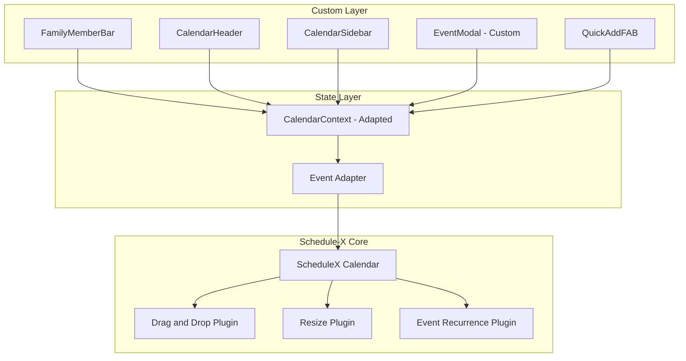
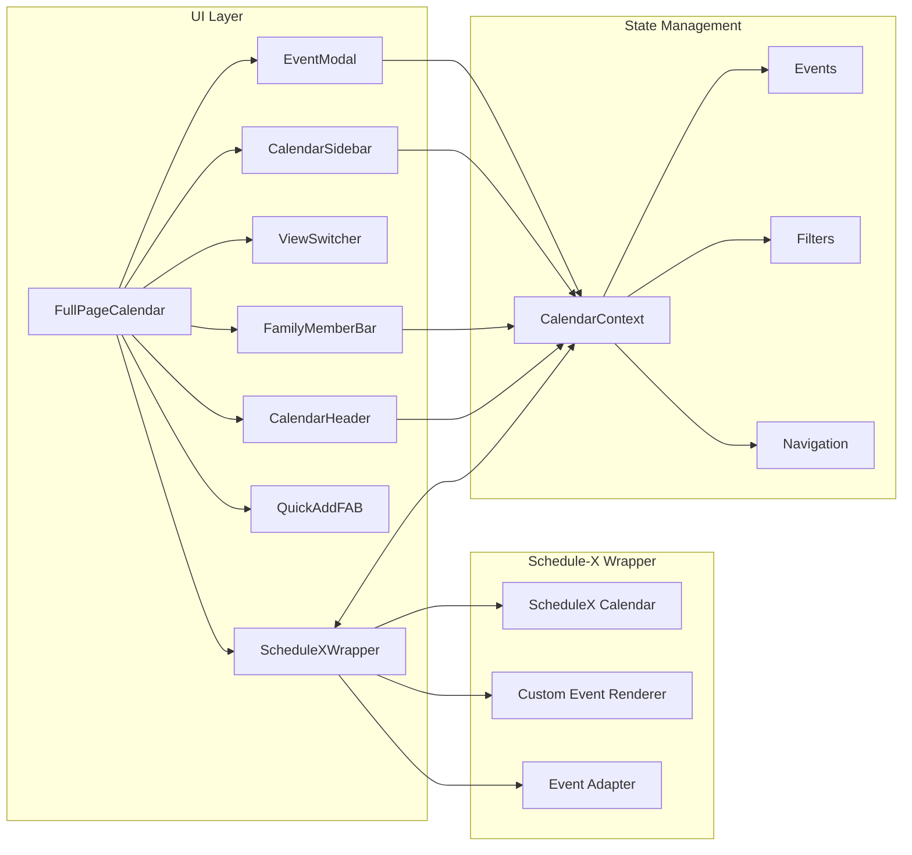
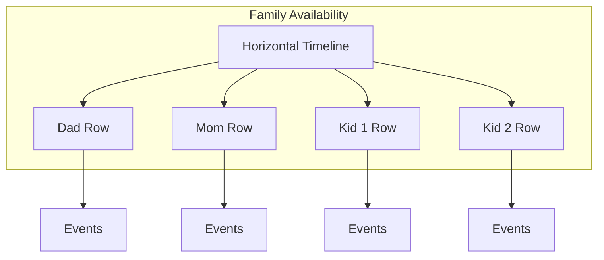

# Schedule-X Calendar Redesign for Family Task Management

## Executive Summary

This document outlines the plan to redesign the home-calendar-dashboard calendar system using the Schedule-X library. The redesign aims to improve performance, maintainability, and family task management capabilities while preserving existing functionality.

---

## 1. Current Implementation Analysis

### 1.1 Architecture Overview

The current calendar implementation is a custom-built solution with the following structure:

```
src/
├── components/calendar/
│   ├── FullPageCalendar.tsx    # Main container orchestrating all calendar components
│   ├── CalendarHeader.tsx      # Navigation and title display
│   ├── CalendarSidebar.tsx     # Mini calendar and calendar list
│   ├── FamilyMemberBar.tsx     # Family member filter/selection UI
│   ├── ViewSwitcher.tsx        # Day/Week/Month/Agenda toggle
│   ├── EventCard.tsx           # Event display with 3 variants: compact, time, full
│   ├── EventModal.tsx          # Event creation/editing form
│   ├── QuickAddFAB.tsx         # Floating action button for quick event creation
│   └── views/
│       ├── MonthView.tsx       # Grid-based month display
│       ├── WeekView.tsx        # Time-based week display with hour slots
│       ├── DayView.tsx         # Single day time-based view
│       └── AgendaView.tsx      # List-based upcoming events view
├── contexts/
│   ├── CalendarContext.tsx     # Main state management with useReducer
│   └── DisplayCalendarContext.tsx # Read-only display mode context
└── types/
    └── calendar.ts             # TypeScript interfaces and types
```

### 1.2 State Management

The [`CalendarContext`](src/contexts/CalendarContext.tsx:1) uses React's `useReducer` pattern with the following state shape:

```typescript
interface CalendarState {
    currentView: CalendarViewType;      // day | week | month | agenda
    selectedDate: Date;
    events: CalendarEvent[];
    calendars: Calendar[];
    familyMembers: FamilyMember[];
    visibleCalendarIds: string[];
    selectedMemberIds: string[];
    isEventModalOpen: boolean;
    editingEvent: CalendarEvent | null;
    isLoading: boolean;
}
```

**Key Features:**
- Optimistic updates for Google Calendar sync
- Local storage persistence for offline events
- RRule-based recurring event expansion
- Multi-account Google Calendar support
- Family member assignment and filtering

### 1.3 Event Data Model

```typescript
interface CalendarEvent {
    id: string;
    title: string;
    description?: string;
    location?: string;
    start: Date;
    end: Date;
    isAllDay: boolean;
    calendarId: string;
    category: EventCategory;
    color?: string;
    recurrence: RecurrencePattern;
    rrule?: string;                    // RFC 5545 recurrence rule
    recurrenceEndDate?: Date;
    recurrenceParentId?: string;       // For expanded instances
    assignedTo: string[];              // Family member IDs
    createdAt: Date;
    updatedAt: Date;
    mealType?: 'breakfast' | 'lunch' | 'dinner' | 'snack';
}
```

### 1.4 Current Strengths

1. **Rich family features**: Member assignment, color coding, filtering
2. **Google Calendar integration**: Multi-account support with bidirectional sync
3. **Recurring events**: RRule expansion for complex patterns
4. **Category system**: 10 categories with icons and colors
5. **Responsive design**: Mobile-friendly with Tailwind CSS

### 1.5 Current Limitations

1. **Custom view implementations**: Each view is manually coded with complex date calculations
2. **No drag-and-drop**: Events cannot be moved by dragging
3. **No resize**: Event duration cannot be adjusted visually
4. **Limited performance**: Large event sets may cause re-render issues
5. **Maintenance burden**: Four separate view components to maintain

---

## 2. Schedule-X Integration Approach

### 2.1 Why Schedule-X?

Schedule-X is a modern, lightweight calendar library that provides:

- **Built-in views**: Day, Week, Month views out of the box
- **Drag-and-drop**: Native event dragging and resizing
- **Plugin architecture**: Extensible via plugins
- **React support**: First-class React bindings
- **TypeScript**: Full type safety
- **Customizable**: Theming and custom event renderers
- **Performance**: Optimized rendering with virtual scrolling

### 2.2 Schedule-X Core Plugins to Use

```
@schedule-x/react              # React wrapper
@schedule-x/calendar           # Core calendar engine
@schedule-x/theme-default      # Base theme for customization
@schedule-x/drag-and-drop      # Event dragging
@schedule-x/event-modal        # Built-in modal OR custom
@schedule-x/resize             # Event duration resize
@schedule-x/event-recurrence   # Recurring events
```

### 2.3 Integration Strategy

**Approach: Hybrid Integration**

We will use Schedule-X for the core calendar rendering while maintaining our custom wrapper components for family-specific features.



---

## 3. Component Architecture

### 3.1 Components to Keep - Modified

| Component | Changes Required |
|-----------|------------------|
| [`FamilyMemberBar.tsx`](src/components/calendar/FamilyMemberBar.tsx:1) | Minor - connect to Schedule-X event filtering |
| [`CalendarHeader.tsx`](src/components/calendar/CalendarHeader.tsx:1) | Minor - adapt navigation to Schedule-X API |
| [`CalendarSidebar.tsx`](src/components/calendar/CalendarSidebar.tsx:1) | Minor - mini calendar may use Schedule-X or remain custom |
| [`EventModal.tsx`](src/components/calendar/EventModal.tsx:1) | Keep - family assignment features not available in Schedule-X |
| [`QuickAddFAB.tsx`](src/components/calendar/QuickAddFAB.tsx:1) | No changes - triggers modal |

### 3.2 Components to Replace

| Current Component | Schedule-X Replacement |
|-------------------|------------------------|
| [`MonthView.tsx`](src/components/calendar/views/MonthView.tsx:1) | Schedule-X Month View |
| [`WeekView.tsx`](src/components/calendar/views/WeekView.tsx:1) | Schedule-X Week View |
| [`DayView.tsx`](src/components/calendar/views/DayView.tsx:1) | Schedule-X Day View |
| [`AgendaView.tsx`](src/components/calendar/views/AgendaView.tsx:1) | Custom component OR Schedule-X list plugin |
| [`EventCard.tsx`](src/components/calendar/EventCard.tsx:1) | Custom event renderer for Schedule-X |

### 3.3 New Components to Create

```typescript
// New file structure
src/components/calendar/
├── ScheduleXCalendar.tsx       # Main Schedule-X wrapper
├── ScheduleXEventRenderer.tsx  # Custom event rendering with family avatars
├── ScheduleXAdapter.ts         # Event format conversion utilities
├── useScheduleXCalendar.ts     # Hook bridging CalendarContext to Schedule-X
└── schedule-x-theme.css        # Custom theme overrides
```

### 3.4 Proposed New Architecture



---

## 4. Family-Focused Feature Enhancements

### 4.1 Current Family Features to Preserve

1. **Family member assignment** - Multiple members per event
2. **Member color coding** - Visual distinction per family member
3. **Member filtering** - Show/hide events by member
4. **Avatar badges** - Event count indicators on member avatars
5. **Broadcast mode** - Create event in multiple calendars simultaneously

### 4.2 New Family Features to Add

#### 4.2.1 Enhanced Member Indicators on Events

```typescript
// Custom event renderer showing assigned members
interface FamilyEventProps {
    event: CalendarEvent;
    members: FamilyMember[];
}

// Display avatars stacked on event cards
// Show member colors as accent border
// Compact mode: show initials only
```

#### 4.2.2 Drag-and-Drop with Member Context

- When dragging an event, show which family members are affected
- Option to reassign during drag if dropping on a member-specific zone
- Visual feedback showing member availability

#### 4.2.3 Quick Member Assignment

- Right-click context menu to quickly assign/unassign members
- Keyboard shortcuts for member selection
- Bulk assignment for multiple selected events

#### 4.2.4 Family Availability View



#### 4.2.5 Task Completion Tracking

- Add task/todo capability to events
- Checkbox for completion status
- Visual indicators for completed vs pending tasks
- Family member accountability tracking

### 4.3 Accessibility Improvements

- Keyboard navigation for all calendar operations
- Screen reader announcements for event changes
- High contrast mode support
- Focus management for modal interactions
- ARIA labels for family member indicators

---

## 5. Data Layer Adaptations

### 5.1 Event Format Adapter

Schedule-X uses a different event format. We need an adapter layer:

```typescript
// Current format
interface CalendarEvent {
    id: string;
    title: string;
    start: Date;
    end: Date;
    // ... family-specific fields
}

// Schedule-X format
interface ScheduleXEvent {
    id: string;
    title: string;
    start: string;  // ISO string
    end: string;    // ISO string
    // ... Schedule-X specific fields
}

// Adapter functions
function toScheduleXEvent(event: CalendarEvent): ScheduleXEvent;
function fromScheduleXEvent(sxEvent: ScheduleXEvent): CalendarEvent;
```

### 5.2 CalendarContext Modifications

```typescript
// New actions for Schedule-X integration
type CalendarAction =
    | { type: 'SX_EVENT_DRAG'; payload: { eventId: string; newStart: Date; newEnd: Date } }
    | { type: 'SX_EVENT_RESIZE'; payload: { eventId: string; newEnd: Date } }
    | { type: 'SX_VIEW_CHANGE'; payload: CalendarViewType }
    | { type: 'SX_DATE_CHANGE'; payload: Date }
    // ... existing actions
```

### 5.3 Sync with Google Calendar

Current sync logic remains largely unchanged. Key integration points:

1. **On Schedule-X drag/resize** → Call existing [`updateEvent`](src/contexts/CalendarContext.tsx:484) which handles Google sync
2. **On Google sync complete** → Push updated events to Schedule-X calendar instance
3. **Optimistic updates** → Schedule-X renders immediately, background sync to Google

---

## 6. Theme and Styling

### 6.1 Custom Theme Requirements

Match the current warm, family-friendly aesthetic:

```css
/* schedule-x-theme.css */
:root {
    --sx-color-primary: #f97316;        /* Orange-500 */
    --sx-color-primary-light: #fef3c7;  /* Amber-100 */
    --sx-color-surface: #ffffff;
    --sx-color-on-surface: #1e293b;     /* Slate-800 */
    --sx-border-radius: 0.75rem;        /* Rounded-xl */
    --sx-font-family: inherit;
}

/* Event colors based on family member */
.sx-event[data-member-id="parent1"] {
    border-left: 3px solid var(--member-color-dad);
}
```

### 6.2 Responsive Design

- Mobile: Stack sidebar below calendar, simplified event cards
- Tablet: Side-by-side layout with collapsible sidebar  
- Desktop: Full layout with expanded sidebar

---

## 7. Implementation Steps

### Phase 1: Foundation Setup

1. Install Schedule-X packages and dependencies
2. Create basic ScheduleXCalendar wrapper component
3. Implement event adapter layer for format conversion
4. Add Schedule-X CSS and base theme configuration

### Phase 2: Core Integration

5. Replace MonthView with Schedule-X month view
6. Replace WeekView with Schedule-X week view  
7. Replace DayView with Schedule-X day view
8. Implement custom event renderer with family avatars
9. Connect CalendarContext to Schedule-X event handling

### Phase 3: Interactive Features

10. Enable drag-and-drop plugin with Google Calendar sync
11. Enable resize plugin with proper event updates
12. Implement click handlers for event modal integration
13. Add time slot click for new event creation

### Phase 4: Family Features

14. Add family member indicators to custom event renderer
15. Implement member filtering integration with Schedule-X
16. Add right-click context menu for quick member assignment
17. Test broadcast mode with Schedule-X events

### Phase 5: Polish and Migration

18. Apply custom theme matching current design
19. Implement Agenda view replacement or custom list
20. Add keyboard navigation and accessibility features
21. Remove old view components after verification
22. Update tests and documentation

---

## 8. Risk Mitigation

### 8.1 Potential Risks

| Risk | Impact | Mitigation |
|------|--------|------------|
| Schedule-X missing feature | High | Keep custom fallback components |
| Performance regression | Medium | Benchmark before/after, use virtualization |
| Theme incompatibility | Low | Create comprehensive custom theme |
| Google sync conflicts | Medium | Thorough testing with optimistic updates |
| Breaking changes in Schedule-X | Medium | Pin versions, review changelogs |

### 8.2 Rollback Plan

1. Keep current view components in codebase during transition
2. Feature flag to switch between old and new implementations
3. Gradual rollout: Month → Week → Day views

---

## 9. Dependencies to Add

```json
{
  "dependencies": {
    "@schedule-x/react": "^latest",
    "@schedule-x/calendar": "^latest",
    "@schedule-x/theme-default": "^latest",
    "@schedule-x/drag-and-drop": "^latest",
    "@schedule-x/resize": "^latest",
    "@schedule-x/event-recurrence": "^latest"
  }
}
```

---

## 10. Success Criteria

1. **Functional parity**: All current features work with Schedule-X
2. **Drag-and-drop**: Users can move events by dragging
3. **Resize**: Users can adjust event duration by dragging edges
4. **Family features**: Member assignment and filtering work seamlessly
5. **Performance**: Render time equal to or better than current
6. **Mobile experience**: Touch-friendly interactions
7. **Accessibility**: WCAG 2.1 AA compliance
8. **Google sync**: Bidirectional sync continues to work

---

## Appendix A: File Changes Summary

### Files to Modify
- `src/components/calendar/FullPageCalendar.tsx` - Replace view rendering
- `src/contexts/CalendarContext.tsx` - Add Schedule-X integration hooks
- `src/types/calendar.ts` - Add adapter type definitions
- `package.json` - Add Schedule-X dependencies

### Files to Create
- `src/components/calendar/ScheduleXCalendar.tsx`
- `src/components/calendar/ScheduleXEventRenderer.tsx`
- `src/components/calendar/ScheduleXAdapter.ts`
- `src/components/calendar/useScheduleXCalendar.ts`
- `src/styles/schedule-x-theme.css`

### Files to Remove - After Migration
- `src/components/calendar/views/MonthView.tsx`
- `src/components/calendar/views/WeekView.tsx`
- `src/components/calendar/views/DayView.tsx`
- `src/components/calendar/EventCard.tsx` - Replace with ScheduleXEventRenderer

### Files to Keep As-Is
- `src/components/calendar/CalendarHeader.tsx`
- `src/components/calendar/CalendarSidebar.tsx`
- `src/components/calendar/FamilyMemberBar.tsx`
- `src/components/calendar/EventModal.tsx`
- `src/components/calendar/QuickAddFAB.tsx`
- `src/components/calendar/ViewSwitcher.tsx`
- `src/components/calendar/views/AgendaView.tsx` - May need adaptation
